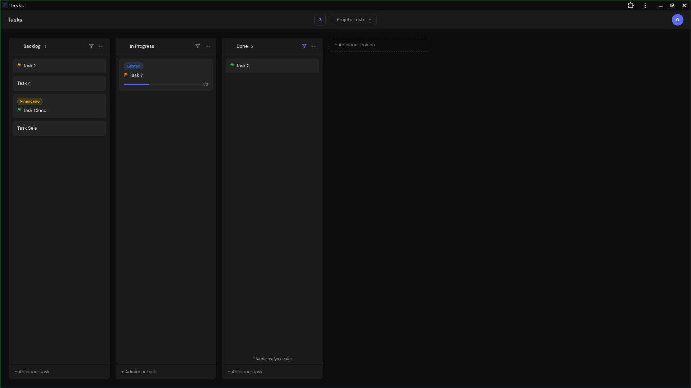
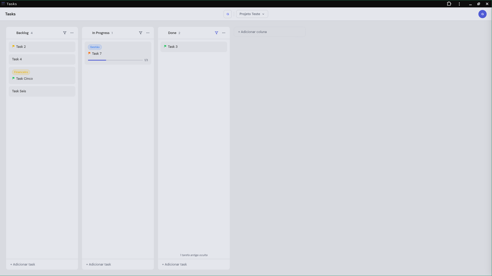

# Tasks

App de gestão de tarefas pessoal estilo Kanban, sem backend próprio.  
Roda como arquivos estáticos com Firebase Auth + Firestore.  
Funciona como **PWA** — pode ser instalado no celular e no desktop, abrindo sem barra do navegador como um app nativo.

Construído com **JavaScript e CSS vanilla** — sem frameworks, sem bundler, sem build step. HTML, CSS e JS puros servidos diretamente pelo browser.

> Todo o código deste projeto — incluindo este README — foi escrito integralmente pelo [Claude Code](https://claude.ai/code) (Anthropic). Nenhuma linha foi digitada manualmente.

---

## Screenshots




---

## Setup do Firebase

### 1. Criar o projeto

1. Acesse [console.firebase.google.com](https://console.firebase.google.com)
2. Clique em **Adicionar projeto** e siga os passos
3. Desative o Google Analytics se não precisar

### 2. Ativar Authentication

1. No menu lateral: **Build → Authentication → Começar**
2. Aba **Sign-in method** → ative **E-mail/senha** e/ou **Google**
3. Para criar usuários com e-mail/senha: **Usuários → Adicionar usuário**

### 3. Criar o banco Firestore

1. No menu lateral: **Build → Firestore Database → Criar banco de dados**
2. Escolha **Edição Standard**
3. Selecione a região **`southamerica-east1` (São Paulo)** para menor latência no Brasil
4. Inicie em **modo de produção**

### 4. Configurar regras do Firestore

No Firebase Console → Firestore → **Rules**, cole e publique:

```
rules_version = '2';
service cloud.firestore {
  match /databases/{database}/documents {
    match /users/{uid}/{document=**} {
      allow read, write: if request.auth != null && request.auth.uid == uid;
    }
  }
}
```

### 5. Inserir as credenciais no projeto

No Firebase Console → **Configurações do projeto (⚙️) → Seus aplicativos → SDK setup**,  
copie o objeto `firebaseConfig`.

Depois, na pasta `public/`:

```bash
cp firebase-config.example.js firebase-config.js
```

Abra `firebase-config.js` e substitua os valores pelos do seu projeto Firebase.

---

## Rodar localmente

Qualquer servidor HTTP estático funciona. Exemplos:

```bash
# Python
python3 -m http.server 8080

# Node.js
npx serve public/
```

Acesse `http://localhost:8080` no browser.

> **Não abra o `index.html` diretamente** (protocolo `file://`) — o Firebase não conecta corretamente sem um servidor HTTP.

---

## Deploy

### Firebase Hosting

```bash
npm install -g firebase-tools
firebase login
firebase deploy
```

O arquivo `firebase.json` já está configurado apontando para a pasta `public/`.

### Host compartilhado (FTP)

Faça upload de todos os arquivos da pasta `public/` via FTP para a raiz do seu domínio ou subpasta.  
Não há build step — os arquivos são servidos diretamente.

---

## Funcionalidades

- Workspaces e projetos com alternância via dropdown na navbar
- Colunas kanban com drag & drop (reordenação e movimentação entre colunas)
- Tasks com título, descrição, data de conclusão e tags coloridas
- Subtarefas com checkbox e barra de progresso no card
- Drawer lateral para edição completa da task
- Tags por projeto: nome + cor, reutilizáveis em qualquer task
- Login com e-mail/senha ou conta Google
- Menu de usuário com edição de perfil e toggle de tema claro/escuro
- Skeleton loader ao carregar projetos
- PWA — instalável no celular e desktop (abre sem barra do navegador)

---

## Estrutura

```
├── public/
│   ├── index.html              Entrada, estrutura HTML
│   ├── style.css               Todos os estilos (dark + light theme)
│   ├── firebase.js             Inicialização do Firebase
│   ├── firebase-config.js      Credenciais do Firebase (não versionado)
│   ├── firebase-config.example.js  Template de credenciais
│   ├── auth.js                 Login, logout, auth guard
│   ├── app.js                  Entry point, orquestração
│   ├── workspaces.js           CRUD + UI de workspaces
│   ├── projects.js             CRUD + UI de projetos
│   ├── profile.js              Perfil do usuário
│   ├── board.js                CRUD + UI do board e colunas
│   ├── tasks.js                CRUD + UI das tasks, drawer e subtarefas
│   ├── tags.js                 CRUD de tags por projeto
│   ├── drag.js                 Drag and drop com SortableJS
│   ├── manifest.json           Manifesto PWA
│   └── sw.js                   Service worker (cache offline)
├── firestore.rules             Regras de segurança do Firestore
├── firebase.json               Configuração do Firebase CLI
└── README.md
```
